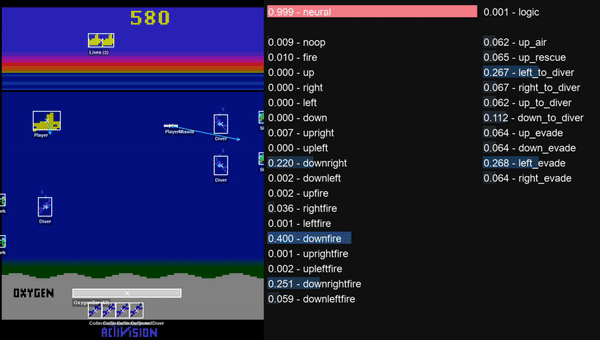
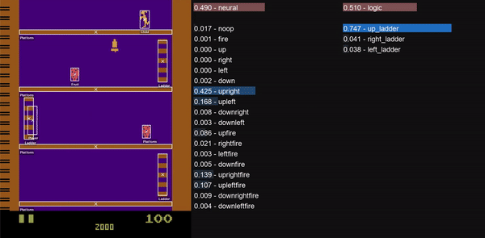

### *Refactoring is undergoing.
# BlendRL: A Framework for Merging Symbolic and Neural Policies (ICLR 2025)
[Hikaru Shindo](https://www.hikarushindo.com/), [Quentin Delfosse](https://ml-research.github.io/people/qdelfosse/index.html), [Devendra Singh Dhami](https://sites.google.com/view/devendradhami), [Kristian Kersting](https://ml-research.github.io/people/kkersting/index.html)


*We propose a framework that jointly learns symbolic and neural policies for reinforcement learning.*
<!--  -->



## Quickstart

### Installation
Follow [INSTALLATION.md](INSTALLATION.md) to install dependencies.


<!--
1. Install all requirements via
    ```bash
    pip install -r requirements.txt
    ```
2. On project level, simply run `python train.py` to start a new training run.
-->

Download the trained agents:
```
wget https://next.hessenbox.de/index.php/s/NbJArsWJXHeAZjt/download -O models.zip
unzip models.zip
rm models.zip
```
Then you can run the play script:
```
python play_gui.py --env-name kangaroo --agent-path models/kangaroo_demo
python play_gui.py --env-name seaquest --agent-path models/seaquest_demo
```
Note that a checkpoint is required to run the play script.


You can run the training script:
```
python train_blenderl.py --env-name seaquest --joint-training --num-steps 128 --num-envs 5 --gamma 0.99
```
- --joint-training: train neural and logic modules jointly
- --num-steps: the number of steps for policy rollout
- --num-envs: the number of environments to train agents
- --gamma: the discount factor for future rewards


## How to Use
<!-- ### Hyperparameters
The hyperparameters are configured inside `in/config/default.yaml` which is loaded as default. You can specify a different configuration by providing the corresponding YAML file path as an argument, e.g., `python train.py in/config/my_config.yaml`. A description of all hyperparameters can be found in `train.py`. -->

### The Logic
Inside `in/envs/[env_name]/logic/[ruleset_name]/`, you find the logic rules that are used as a starting point for training. You can change them or create new rule sets. The ruleset to use is specified with the hyperparam `rules`.

<!-- ### Install Locally
If you want to use NUDGE within other projects, you can install NUDGE locally as follows:
1. Inside ```nsfr/``` run
    ```bash
    python setup.py develop
    ```
2. Inside ```nudge/``` run
    ```bash
    python setup.py develop
    ``` -->

<!-- ### Ohter dependencies
1. Install packages by `pip install -r requirements.txt` 

2. PyG and torch-scatter for neumann
Install PyG and torch-scatter packages for neumann reasoner. See the [installation guide](https://pytorch-geometric.readthedocs.io/en/latest/notes/installation.html). These should be consistent in terms of ther versions, e.g.
    ```
    pip install torch==1.12.0+cu116 torchvision==0.13.0+cu116 -f https://download.pytorch.org/whl/torch_stable.html
    pip install torch_geometric
    pip install pyg_lib torch_scatter torch_sparse -f https://data.pyg.org/whl/torch-1.12.0+cu116.html -->
    ```


## How to Set up New Environments
You add a new environment inside `in/envs/[new_env_name]/`. There, you need to define a `NudgeEnv` class that wraps the original environment in order to do
* **logic state extraction**: translates raw env states into logic representations
* **valuation**: Each relation (like `closeby`) has a corresponding **valuation function** which maps the (logic) game state to a probability that the relation is true. Each valuation function is defined as a simple Python function. The function's name must match the name of the corresponding relation.
* **action mapping**: action-predicates predicted by the agent need to be mapped to the actual env actions

See the `freeway` env to see how it is done.